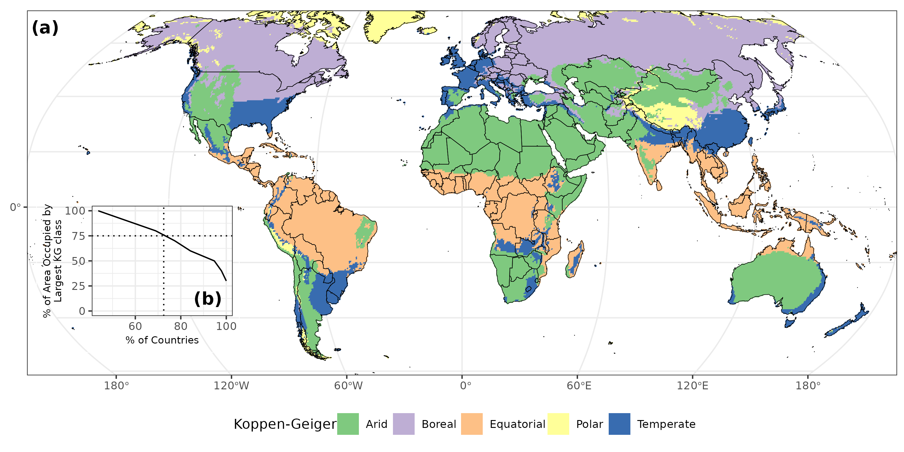
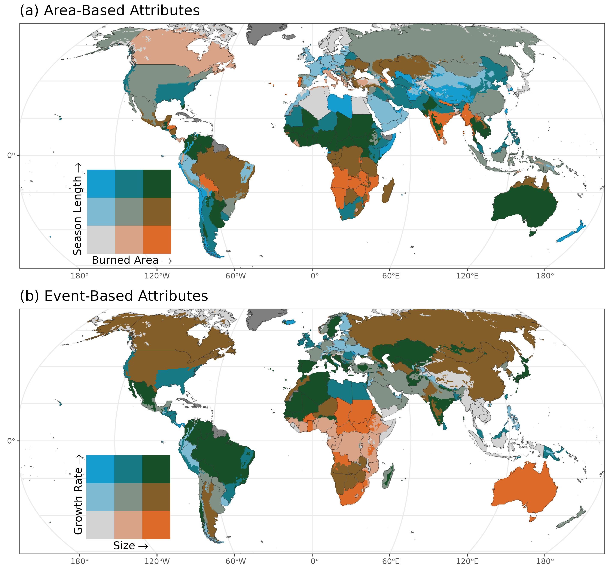
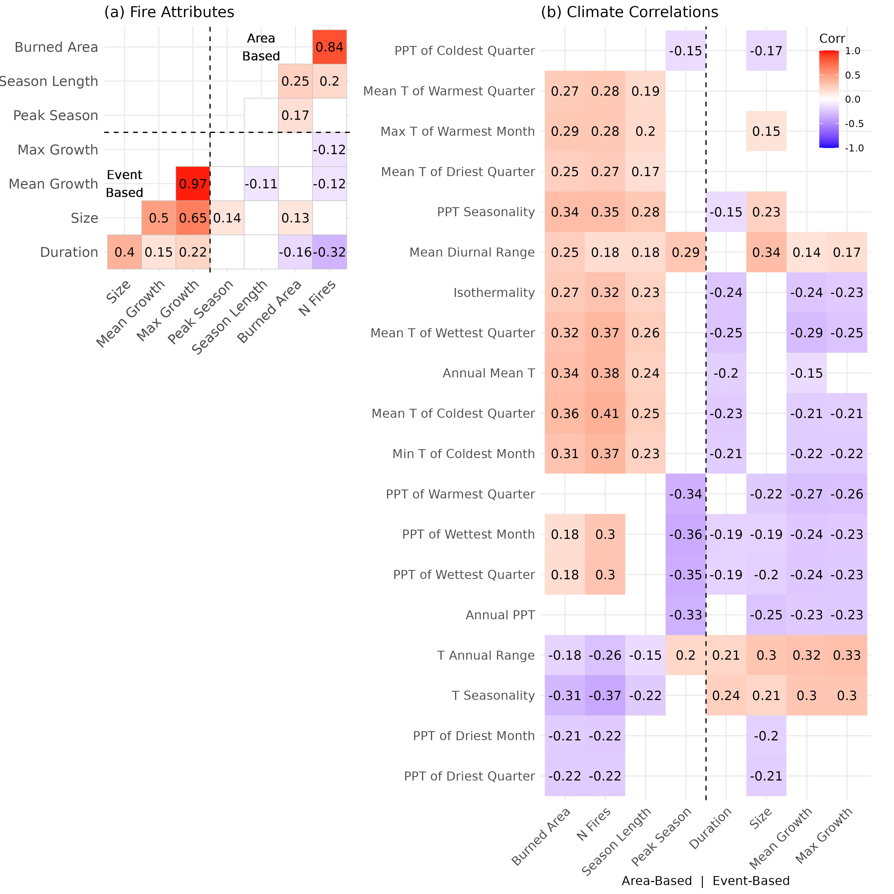
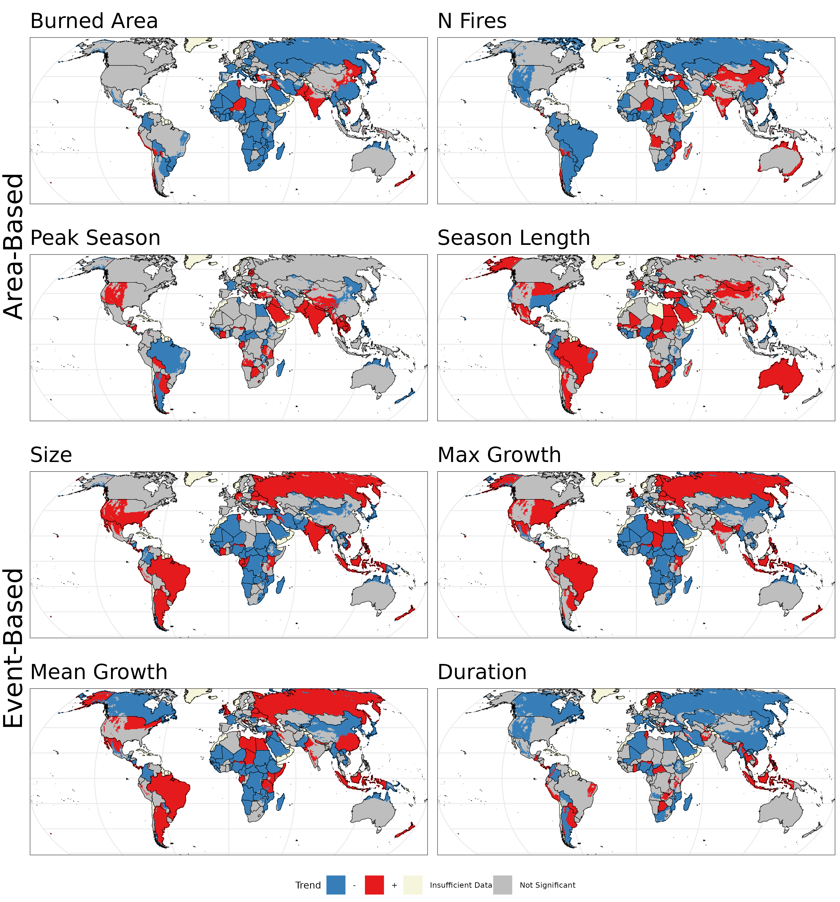
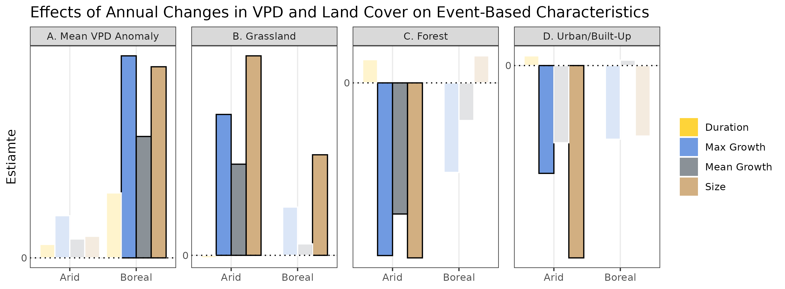

# Data and Code for: "The properties of individual fire events are essential for understanding global fire regimes"

Code to reproduce the entire analysis is in the R folder. The manuscript is available as a preprint at __(DOI coming soon)__.
We used fire perimeter products for every country and overlayed Koppen-Geiger climate classifications.

We calculated 8 attributes of fire regimes for each KG classification within each country. We characterized fire regime components as area-based or event-based. Area-based metrics may or may not require the deliniation of events (e.g. number of fires requires event delineation), but essentially do not require any knowledge of the inner workings of individual events. Event-based metrics require event-level attributes, spatial (size), temporal (duration), combinations of the two (growth rate). Other event-based metrics also exist, obviously, but were not studied here (e.g. intensity and severity).

Four were area-based: 

 - Burned area
 - Number of fires
 - Season Peak
 - Season Length

Four were event-based

 - Fire size
 - Max growth (area burned on the day with the highest area burned)
 - Mean growth (size/duration)
 - Duration

Here are the spatial patterns:

Here are the correlations between fire regime components and among fire regime components and the 19 bioclimatic variables from WorldClim:

Here are the temporal trends:

Finally, we examined associations between interannual variability of the event-based components, landcover and VPD anomaly, for arid and boreal regions. We wanted to examine the general idea of energy versus fuel limitation for the event-based fire regime components:

For ancillary data for the linear mixed model analysis (annual land cover estimates, climate means and anomalies), extraction of gridded products was implemented in the Google Earth Engine cloud-compute platform. The associated code is available in a public repository (https://code.earthengine.google.com/?accept_repo=users/maco/global-fire). A login is required to access these scripts.
